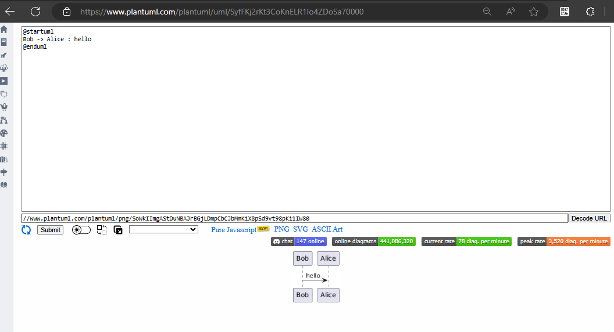
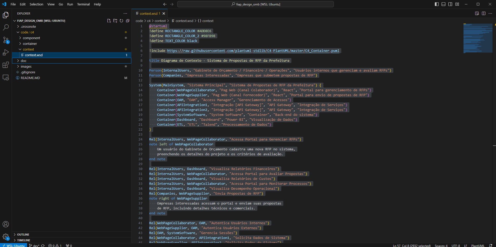
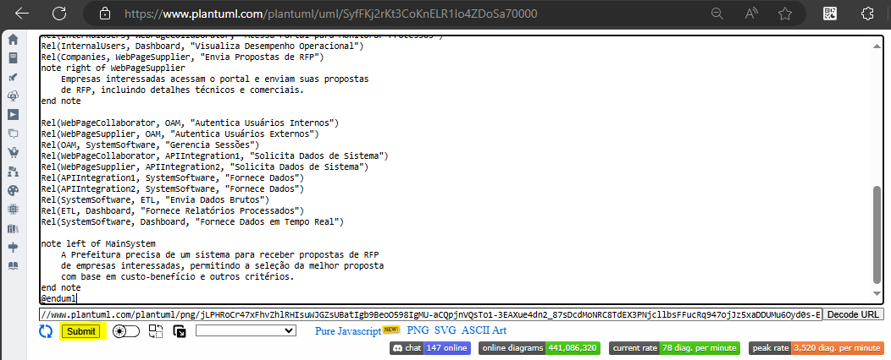
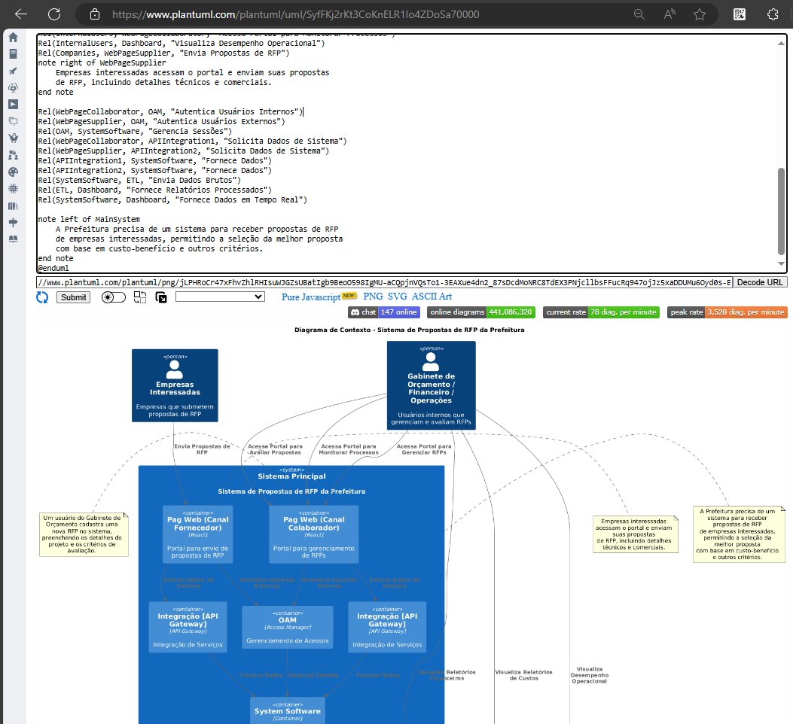

# FIAP Design OMB

## Objetivo
Este repositório contém recursos e documentação para o projeto de Arquitetura de Design da FIAP.

## Estrutura do Repositório

- **images/**: Contém diagramas relacionados ao projeto, como diagramas de contexto, contêineres e componentes.
- **docs/**: Documentação sobre o design, arquitetura e perguntas.
- **code/**: codigo para geração e manipulação de diagramas e modelos.

## Como Usar

### Para visualizar os diagramas
1. **Acesse o [PlantUML](https://www.plantuml.com/plantuml/uml/SyfFKj2rKt3CoKnELR1Io4ZDoSa70000)**

2. **Copie o codigo code/c4/context/context.wsd e cole**

3. **Clique em Submit**

4. **O diagrama será apresentado abaixo**
