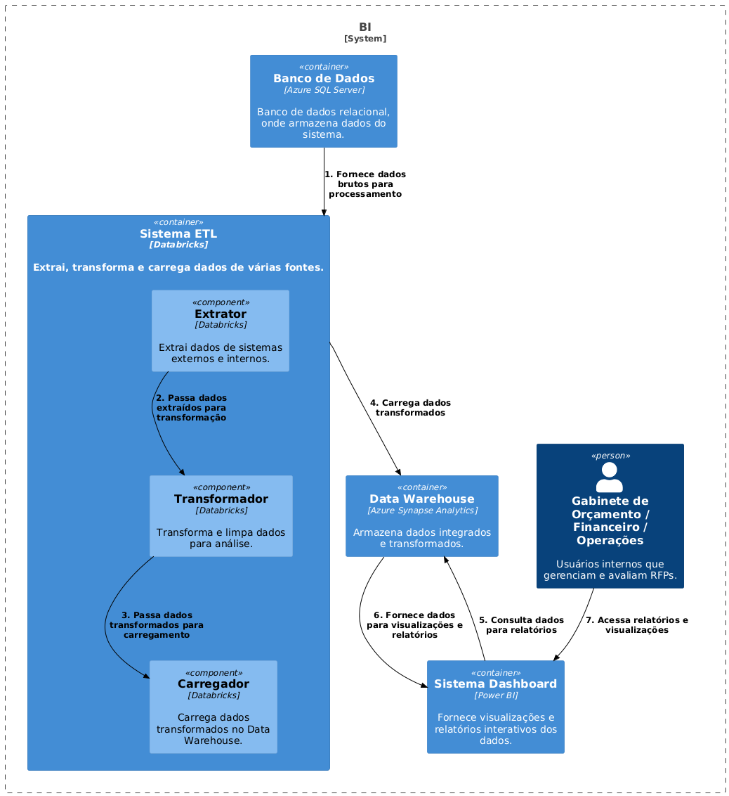

Atividade para entregar Turmas ASO 
1. Montar um Story Telling sobre o problema que você resolve e definir o tema (Verificar nos 
slides da aula 1 sobre os temas sugeridos). 

2. O que esperamos aprender com esse projeto? 
Determinar os requisitos específicos;
Melhorar processos existentes;
Garantir conformidade com órgãos reguladores;

3. 3. Que perguntas precisamos que sejam respondidas? 
Problemas que existem no processo atual
Quantidade de usuários?
Saber se existem órgão regulador?
Quais são os nossos principais riscos?
Quais requisitos dos Órgãos reguladores?
Temos auditoria que o sistema deve passar?

4. Quais são os nossos principais riscos? 
Atraso;
Falta de entendimento;
Pessoas;
Segurança da informação;
Resistência a mudanças;

5. Crie um plano para aprender o que precisamos para responder a perguntas específicas. 
Sessões de alinhamento com as partes interessadas.
Aplicar metodologias para garantir a participação dos interessados para definição clara de requisitos.
Ambiente colaborativo;
Motivar os usuários participarem;

6. Crie um plano para reduzir riscos. 
Planejamento detalhado e gestão eficiente do projeto;
Implementação de medidas de segurança robustas;
Desenvolvimento de contingência;
Treinamentos para usuários;
Envolvimento dos usuários no processo de desenvolvimento;

7. Quem são as partes interessadas? 
Prefeito;
Gabinete de Gestão e Orçamento;
Empresas;
Equipe de Tecnologia;

8. O que eles esperam ganhar? 
Economia de custos;
Encontrar melhores contratos;
Tempo;
Eficiência operacional;

9. Quem são os usuários? 
Gabinete de Gestão e Orçamento;
Empresas Parceiras;
Departamento de tecnologia;

10. O que eles estão tentando realizar? 
Corte de Custos;
Encontrar melhores custos nos contratos;
Eficiência operacional

11. Qual o pior que pode acontecer? 
Segurança;
Não encontrar o melhor preço no contrato;
Falha no processo;
Fraudes no processo;

12. Desenhe uma arquitetura; 
MVA

Arquitetura Solução

13. Faça uma descrição de cada um dos componentes que você desenhou; 
MVA
UI - Ponto de entrada para usuários.
Regras de negocio - Conter toda logica de cadastro, fluxo de RFP.
Banco de dados armazena dados;
ETL - Realiza a carga do banco transacional para o banco analitico;
Dashboard - Mostra indicadores importantes;
Solução

14. Descreva requisitos que você (s) considera importante e por quê? (Mínimo 5) 
IU responsiva - Melhora a experiência do usuário, facilitando a navegação.
Banco de dados com alta disponibilidade - Garanto que o sistema fique funcional em caso de falhas.
OLAP - para fins analiticos o banco de dados principal não seja acessado.
Dashboard intuitivo e informativo - fornecendo uma visão geral para tomada de decisões.
Segurança - Garantir que os acessos sejam feito de forma segura;

15. Sobre o que o diagrama ajuda você a raciocinar/pensar? 
Fluxo de dados e seu comportamento entre componentes;
Deixa claro o relacionamento entre Componentes;
Identificação de camadas;
Relacionamento funcional entre componentes;

16. Quais são os padrões essenciais no diagrama? 
Arquitetura de Camadas, camada de apresentação UI, camada lógica e camada de dados;
ETL, para carregar e transformar dados em um destino.

17. Existem padrões ocultos? 
Facade, interface com logica de negocio, proporcionando interface unica para componentes;

18. Qual é o Metamodelo? 
UML Metamodelo.

19. Pode ser discernido no diagrama único? 
Pode sim, apenas contendo a comunicação entre as camadas. Para aprofundar precisamos de outros diagramas.

20. O diagrama está completo? 
MVA, está faltando uma versão mais detalhada.
Solução está mais completa, mas ainda falta como vai ser acessado e as tecnologias.

21. Poderia ser simplificado e ainda assim ser eficaz? 
Se simplificarmos ainda mais, talvez perca alguma informação.

22. Houve alguma discussão importante que vocês tiveram como equipe? 
Qual tipo de Arquitetura utilizamos para resolver o problema, se partiríamos para uma solução mais escalável, onde utilizamos filas, etc ou uma solução mais simples.

23. Que decisões sua equipe teve dificuldade para tomar? 
Como seria a solução, optamos por uma solução mais simples, por conta de custos e também velocidade.

24. Que decisões foram tomadas sob incerteza? 
Volumetria e escalabilidade, se nossa solução precisaria ser muito escalável,

25. Houve algum ponto de decisão sem retorno que o forçou a desistir de uma determinada escolha? 

26. Desenhe 3 Arquiteturas com o projeto que você desenvolveu na aula em cada uma das 
camadas do C4; (Subir somente a Imagem jpg/jpeg) 

27. Nível Contexto 

28. Nível Container 

29. Nível Componente 

30. Code (Opcional) 
31. Validar no checklist (opcional) - https://c4model.com/review/ 
32. Gravar um vídeo explicando o projeto com um todo e desenhos, Obs: todos os integrantes 
devem apresentar uma parte do projeto. 
Subir em um repositório no github e compartilha com o professor 
Dúvidas contatar os E-mail: 
profleonardo.pinho@fiap.com.br/leonardo.c.pinho@gmail.com 
